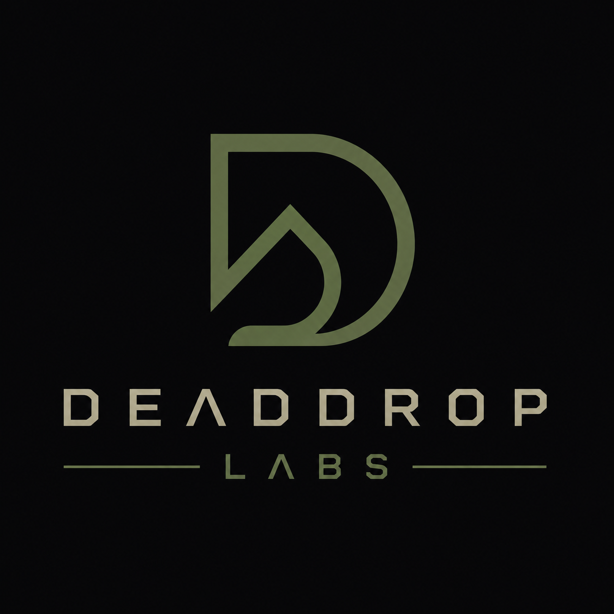
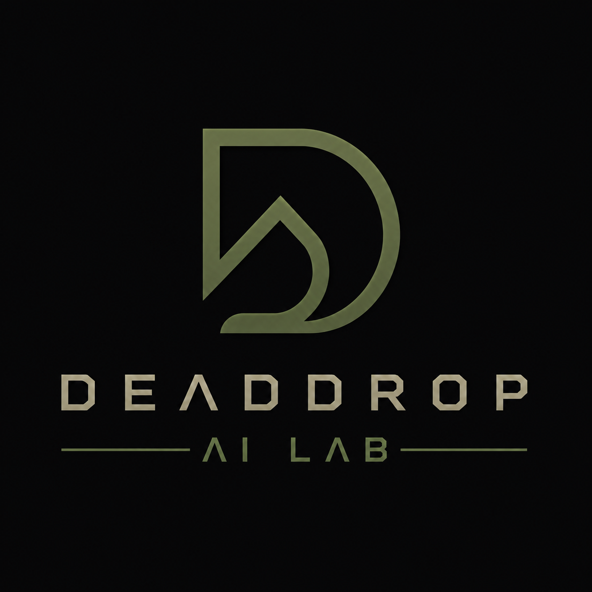
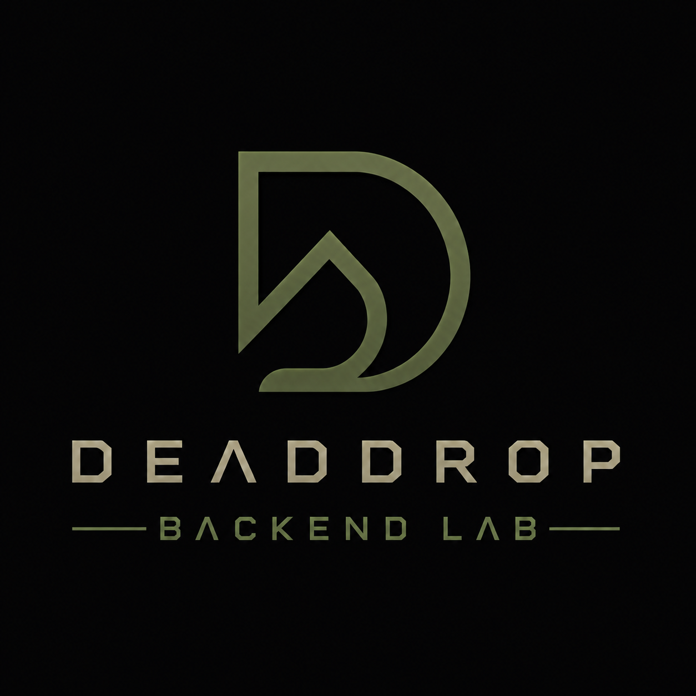
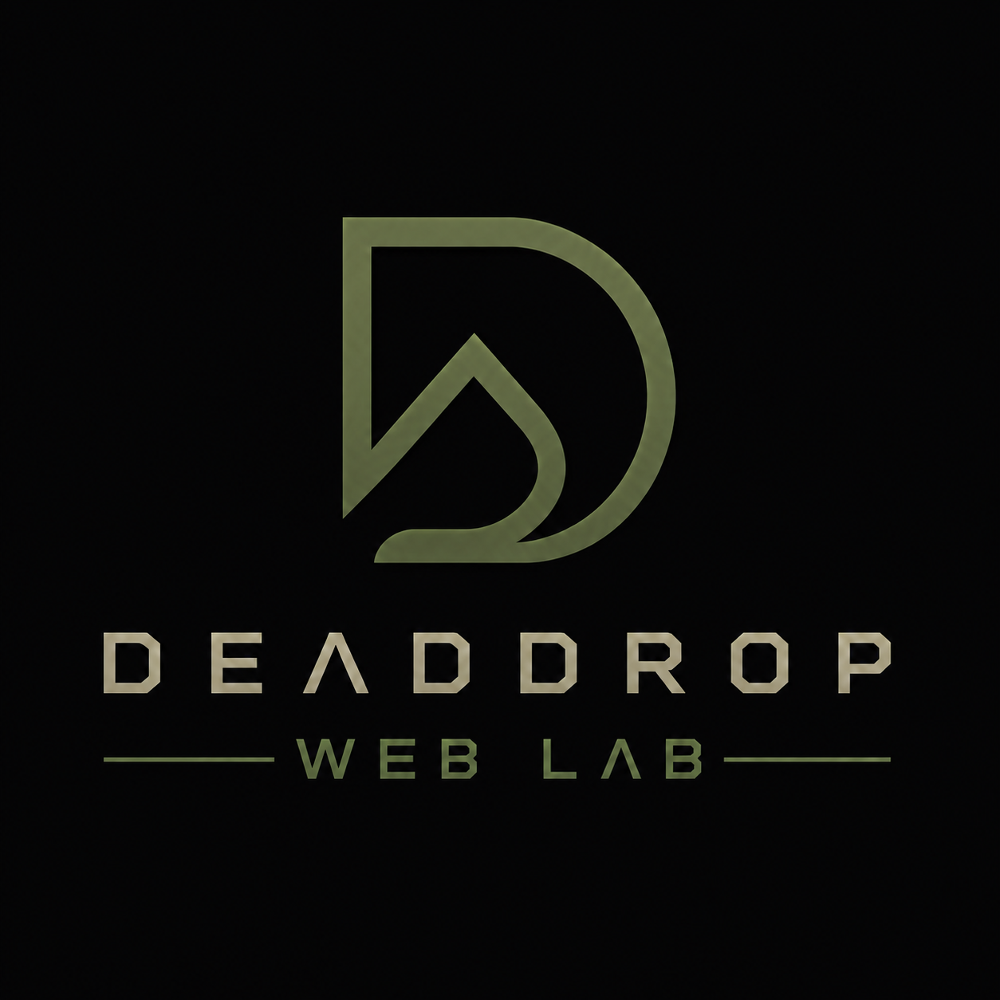
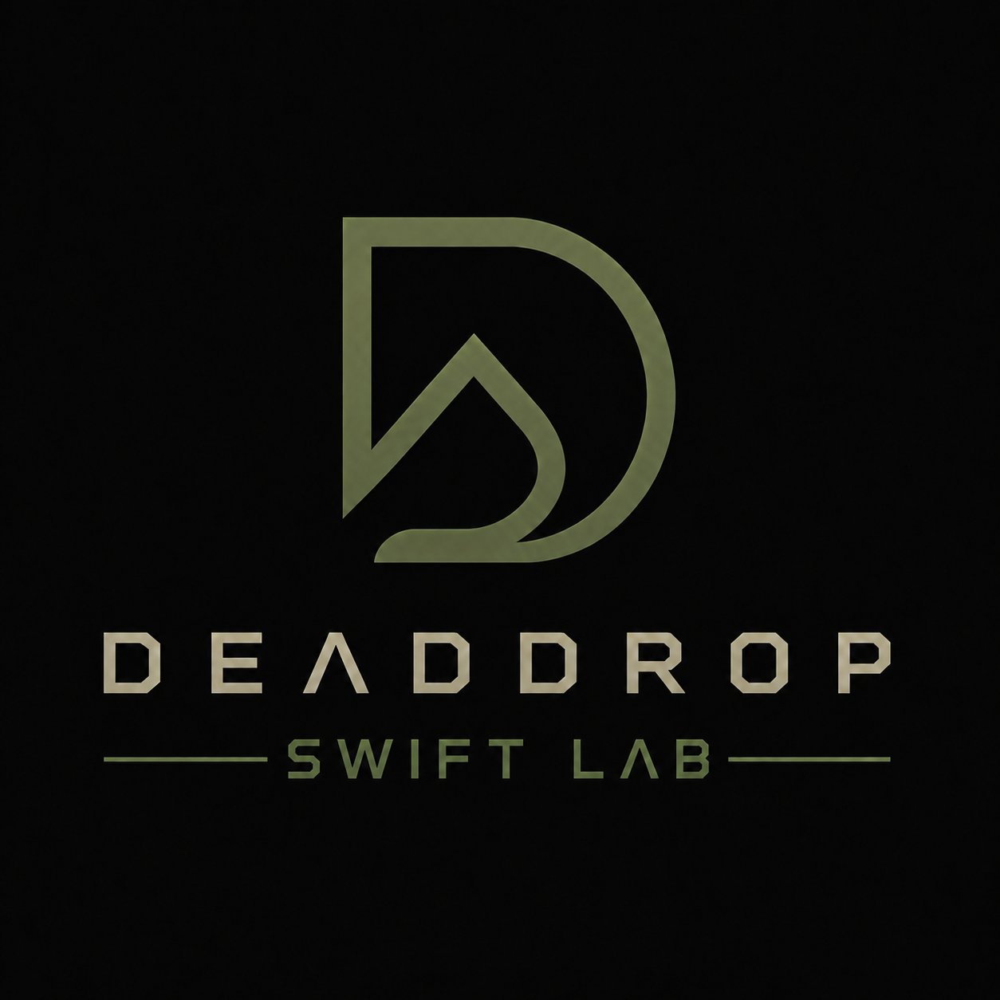
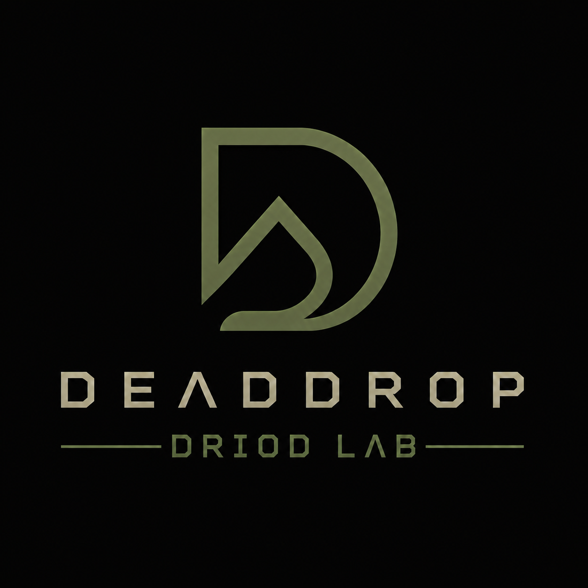
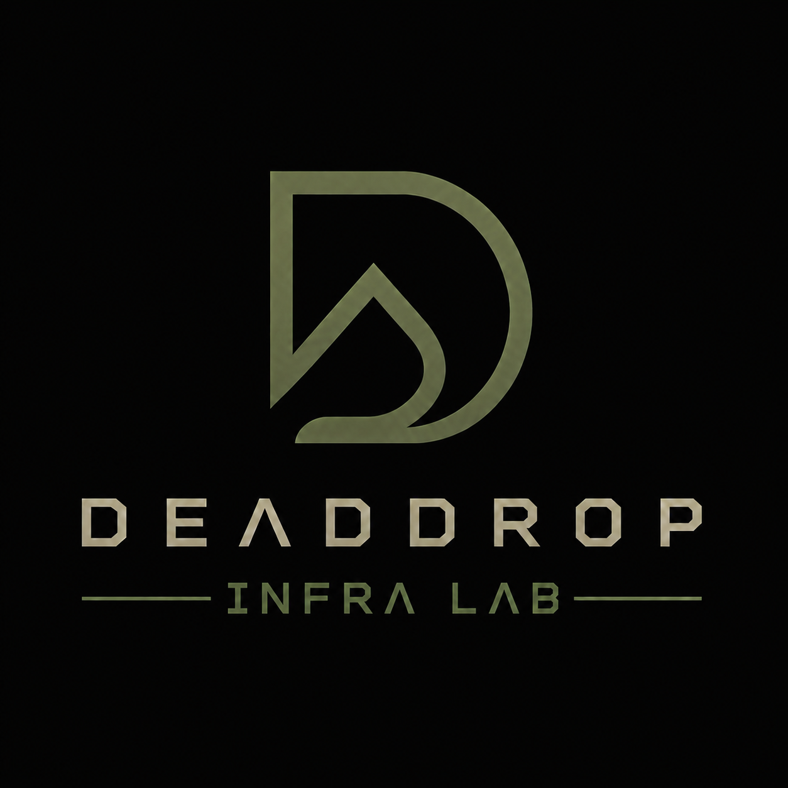

  

<h1 align="center">DeadDropLabs</h1>

Engineering modern software through specialized labs.

AI • Backend • Web • Apple • Android • Infrastructure

---

## About

DeadDropLabs is an engineering organization focused on building modern software across artificial intelligence, backend systems, native applications, web technologies and cloud infrastructure.

Our goal is to build products with long-term maintainability, clean architecture and high engineering standards.

---

## Engineering Labs

<table>
<tr>
<td align="center" width="33%">
 
<b>AI Lab</b> 
Building intelligent systems, AI agents and developer tools.
</td>

<td align="center" width="33%">
 
<b>Backend Lab</b> 
Building scalable backend services, APIs and distributed systems.
</td>

<td align="center" width="33%">
 
<b>Web Lab</b> 
Building modern web applications and frontend experiences.
</td>
</tr>

<tr>
<td align="center">
 
<b>Swift Lab</b> 
Building native applications for the Apple ecosystem.
</td>

<td align="center">
 
<b>Droid Lab</b> 
Building native Android applications with modern technologies.
</td>

<td align="center">
 
<b>Infra Lab</b> 
Building and operating cloud infrastructure and deployment pipelines.
</td>
</tr>
</table>

---

## Engineering Principles

- Simplicity over complexity.
- Clean architecture.
- Native-first development.
- Performance by design.
- Long-term maintainability.
- Developer experience matters.

---

Engineered with 🧠 by DeadDropLabs

